  

---

### :crystal_ball: The Sorting Hat's Verdict

> *"Hmm, difficult. Very difficult. Plenty of courage, I see. Not a bad mind either.*
> *There's talent — oh yes — and a thirst to prove yourself in the deep layers of the stack...*
> *Better be — **Engineering!**"*

I build systems that defend, orchestrate, and scale. From the kernel up through container runtimes to cloud-native platforms — and now into the realm of AI-augmented retrieval. Security is not a layer; it's woven into every incantation.

  

### :scroll: O.W.L. Results — Ordinary Wizarding Levels

*Examinations graded by the Wizarding Examinations Authority*

<table>
  <thead>
    <tr>
      <th>Subject</th>
      <th>Muggle Equivalent</th>
      <th>Grade</th>
      <th>Specialisations</th>
    </tr>
  </thead>
  <tbody>
    <tr>
      <td><b>:shield: Defence Against the Dark Arts</b></td>
      <td>DevSecOps</td>
      <td><code>O — Outstanding</code></td>
      <td>Supply chain security, SAST/DAST, container hardening, zero-trust architectures, SBOM, secrets management</td>
    </tr>
    <tr>
      <td><b>:sparkles: Transfiguration</b></td>
      <td>Kubernetes</td>
      <td><code>O — Outstanding</code></td>
      <td>Cluster orchestration, custom operators, service mesh, GitOps (ArgoCD/Flux), multi-tenancy, CRD design</td>
    </tr>
    <tr>
      <td><b>:zap: Charms</b></td>
      <td>DevOps</td>
      <td><code>O — Outstanding</code></td>
      <td>CI/CD pipelines, IaC (Terraform/Pulumi/OpenTofu), observability (Prometheus/Grafana/OTel), platform engineering</td>
    </tr>
    <tr>
      <td><b>:books: Ancient Runes</b></td>
      <td>Linux Kernel</td>
      <td><code>O — Outstanding</code></td>
      <td>Kernel modules, eBPF, syscall tracing, cgroups/namespaces internals, performance tuning, custom builds</td>
    </tr>
    <tr>
      <td><b>:1234: Arithmancy</b></td>
      <td>RAG Systems</td>
      <td><code>E — Exceeds Expectations</code></td>
      <td>Vector databases, embedding pipelines, retrieval-augmented generation, LLM orchestration, agentic workflows</td>
    </tr>
    <tr>
      <td><b>:test_tube: Potions</b></td>
      <td>Software Engineering</td>
      <td><code>O — Outstanding</code></td>
      <td>System design, distributed systems, API design, polyglot development (Go, Rust, Python, C)</td>
    </tr>
  </tbody>
</table>

  

### :wand_with_ball: Spell Inventory — Tech Stack

**Wand Core** — Languages

**Spell Books** — Platforms & Orchestration

**Potions Ingredients** — Infrastructure & Tooling

**Dark Arts Defence** — Security

**Divination Orbs** — AI & RAG

  

### :newspaper: The Daily Prophet — GitHub Activity

  
  

  

  

### :owl: Send an Owl

*The owlery is always open for collaboration on open-source spellcraft, kernel sorcery, or cloud-native enchantments.*

  

---

  

